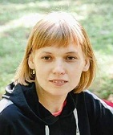

Volha  Kuratnik
============
Discord name: Kwiecien#9756                                        

__Career Goal__ - To finish RS school and obtain a responsible and challenging Front End Developer’s position 
***** 
##### Contact
|                     |                 |                       |           
|:--------------------|:---------------:|----------------------:|
|                     |                 |                       |   
|__Address__          |__Phone number__ |__Email address__     |                                
| Torun, Poland       | +48791647564    |volhakuratnik@gmail.com|
|                     |                 |                       |
                                                                                                        

##### Education and courses
* Bachelor Degree in Mathematics, Minsk, Belarus  

* Master Degree in Logistics, Molde, Norway  
  
* [Basic Front-End Developer Course on Udemy.com](https://www.udemy.com/share/101Wy23@SoAVUfhOxMvH2BEFO7epAmttYr29LsOxMxp-sDshRD1nLVBsvMi3zbeR2HTIIwoP5g==/)
*****
##### Experience
* I just started learning front end development. I have realized one commercial project on my own. This is my first webpage: [http://hub-trans.com/](http://hub-trans.com/)
*****  

|__Languages__                |
|-----------------------------|
|__Russian__ - Native         |
|__Polish__ - Advanced        |
|__English__ - Upper Intermediate|
|                                           |
| [Link to the result of the online test](https://www.efset.org/cert/UNBJ2m)|
|          |  
***** 
__Hobbies__: _Jogging, Cycling, Travel_  
